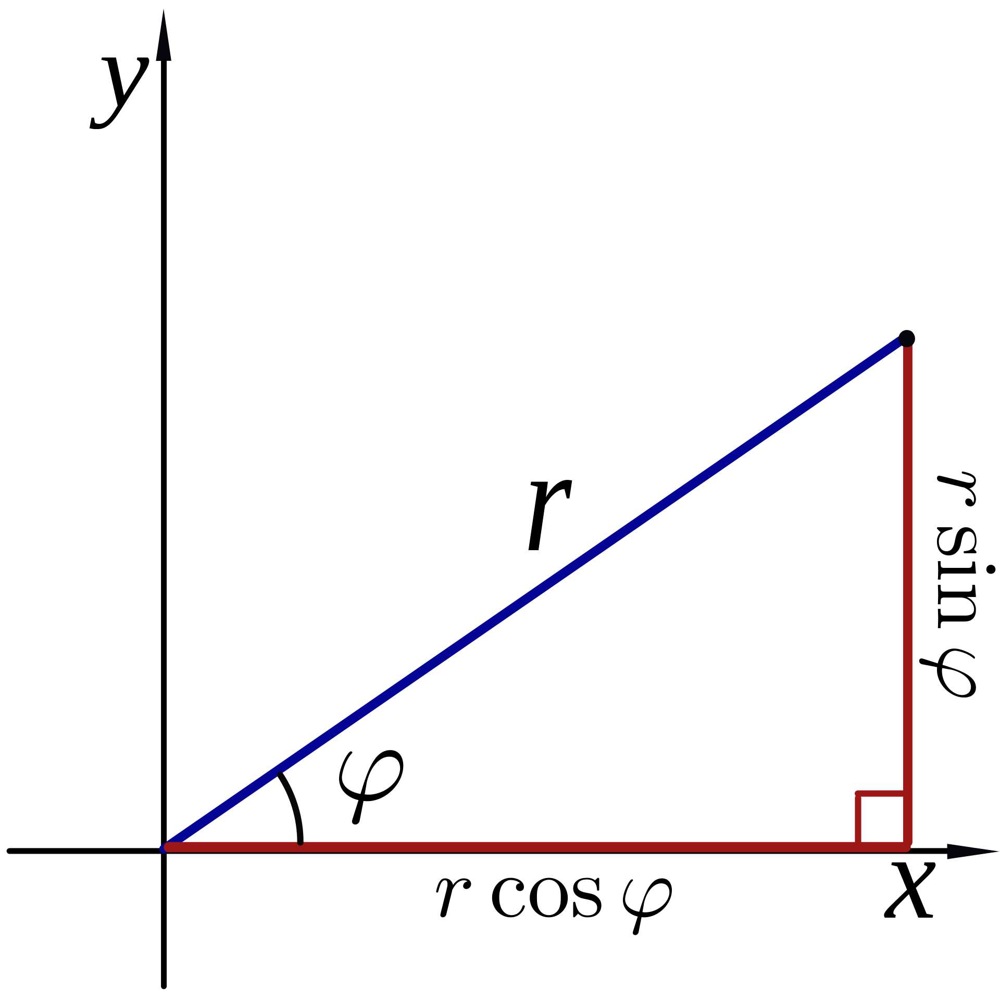

# Is Writing a Game a Good Way To Learn Math?

- making a demo or a simple game can be a great way to learn math
- starting from a concept, you break down the problem into distinct features
- you look for ways to implement each feature
- you are motivated to learn the mathematical concepts
- this motivation tends to be intrinsic

Note to self:
Remember to include just a little bit of back story
for each of the mathematicians attributed to the
concepts that I present: Kepler, Hamilton,
Marsaglia, and Shoemake.

# Simple Orbit

> UPDATE: Consider presenting circular motion first
> as an example of how math can come to life
> when you program it into a computer.

- pick an orbit centred around a fictitious planet
- Kepler's Third Law for a circular orbit:

$$
\begin{aligned}
  T
  &=
  2\pi\sqrt{\frac{R^3}{GM}} \\
\end{aligned}
$$

where:

- $T$ is the orbital period
- $R$ is the radius of the circular orbit
- $G$ is the gravitational constant
- $M$ is the mass of the planet

- assuming the planet is Mars-like
  and the altitude is relatively low (160km):

$$
\begin{aligned}
  T
  &=
  2\pi\sqrt{\frac{R^3}{GM}} \\
  &\doteq
  2\pi\sqrt{\frac{(3.39\times10^6+1.6\times10^5)^3}
  {6.67\times10^{-11}\times6.39\times10^{23}}} \\
  &\doteq
  107\text{ minutes} \\
\end{aligned}
$$

- equations for cicular motion in the XY plane:

$$
\begin{aligned}
  x(t)
  &=
  R\cos(\tfrac{2\pi}{T}t) \\
  y(t)
  &=
  R\sin(\tfrac{2\pi}{T}t) \\
\end{aligned}
$$

# Smooth Transitions Between Views

- want it to be realistic, i.e., representative of a real orbiting spacecraft
- to that end, the transition should take the path of "minimum energy"

## Euler's rotation theorem

> In three-dimensional space, any displacement
> of a rigid body such that a point on the rigid body
> remains fixed, is equivalent to
> a single rotation about some axis
> that runs through the fixed point

- Any 3D rotation can be expressed as a single rotation about a fixed axis

## SLERP

- (S)pherical (L)iner Int(erp)olation
- A smooth interpolation between 2 rotations
- The axis of rotation is Euler's axis
- ~~If we assume a uniform mass distribution,
  this is a "minimum energy" rotation~~

# Random colonies on planet

- we want the locations to appear random,
  but we want every player to see the same world
- not really "random", but "pseudo random" based on a seed value
- a different seed value will generate a completely
  different universe
- every player with the same seed value will see the same
  universe

- Linear Congruential Generator
- simple algorithm but picking suitable values
  is very difficult (and also very difficult to test)
- Marsaglia's famous test suite for randomness
- JavaScript's built-in `Math.random()` does not allow
  you to set the seed
- the other problem is that numbers in JavaScript
  as 64-bit double-precision floating-point numbers
  (no 64-bit integer type built-in)
- after a bit of digging: Park-Miller (show code)

- now, how do we scatter the colonies
  evenly over the planet?

- sphere point picking (Marsaglia)
- but we also want to orient them randomly
- hypersphere point picking, quaternion rotation
